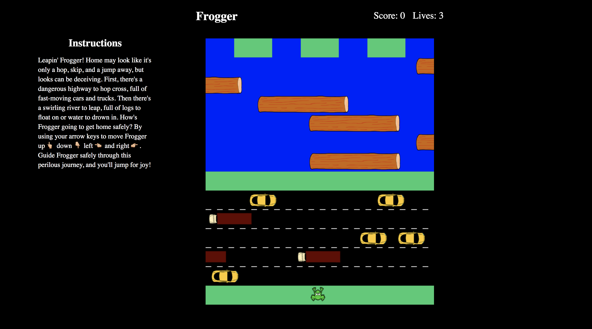

# Game Time Frogger

#### Goals
* Learn object oriented programming (OOP) principles by building a game that is playable in the browser.
* Use OOP to drive the design of the game and the code
* Separate business-logic code from view-related code
* Implement TDD
* Create a robust test suite that thoroughly tests all functionality of a client-side application

<h3 style="text-align: center;">Game View</h3>

**app is not responsive for small screens**
